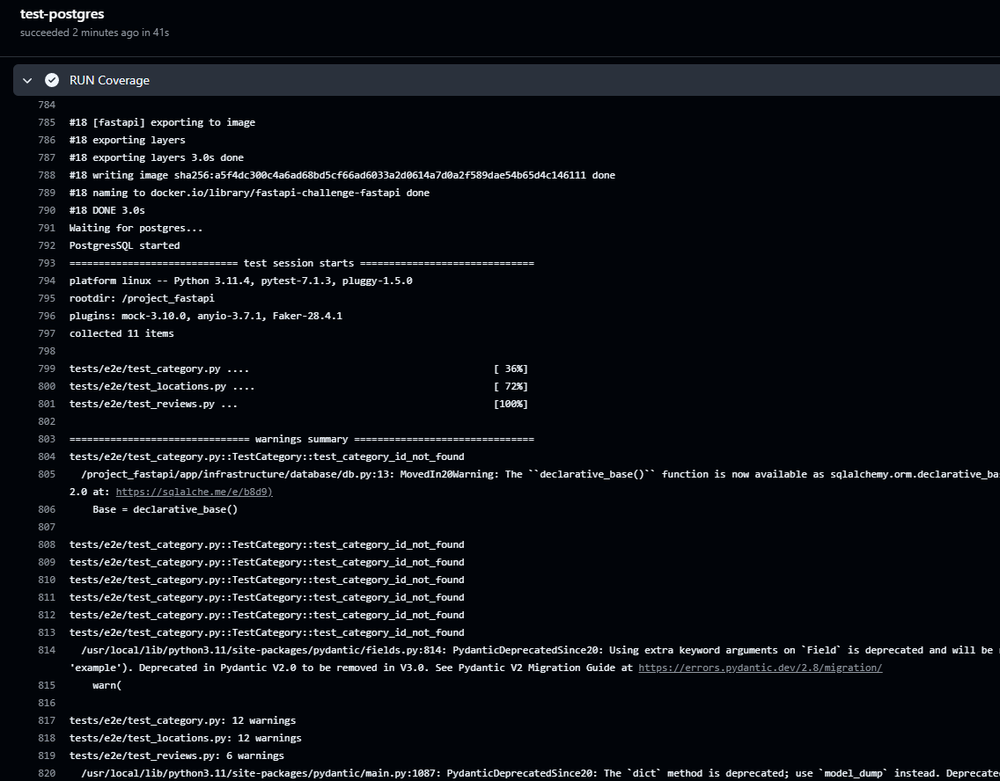
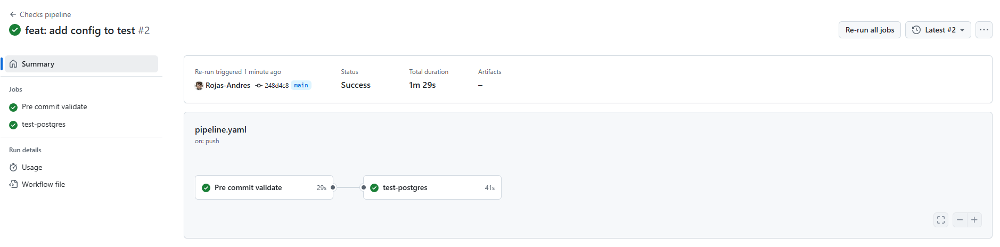
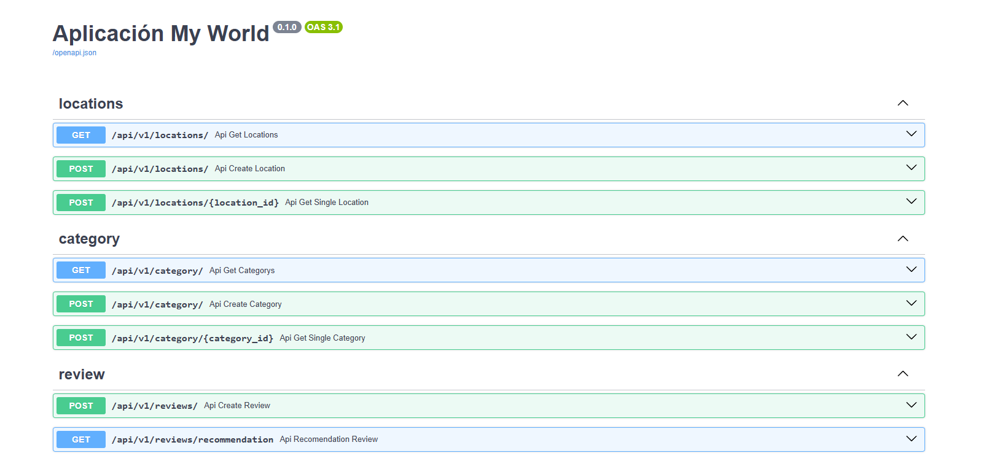
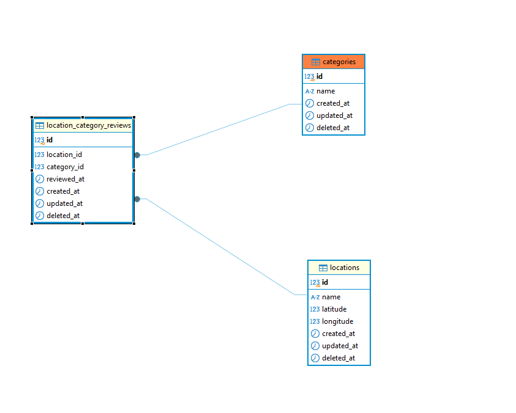
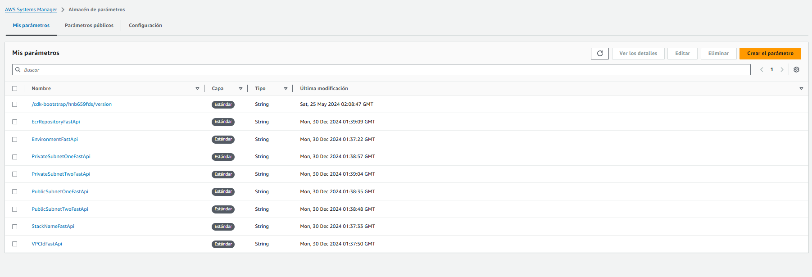
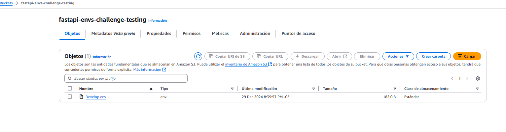
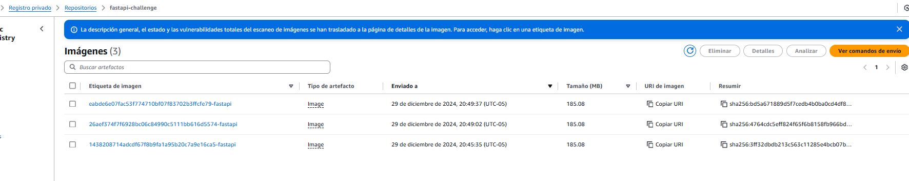

# Challange by Andres Rojas

## correr proyecto

### Setup

1. Clone repository:

- `git clone https://github.com/Rojas-Andres/fastapi-challenge`
- `cd fastapi-challenge`

2. Copy `.env.example` to `.env` and custom:

- `cp .env.example .env`

### Correr proyecto con docker (recordar crear el .env en la raiz)
- ` docker-compose build `
- ` docker-compose up `

## Github CICD validaciones

#### Total de test ejecutados

#### Validacion de pre commit

## Documentacion swagger

## Diagrama ER

## Despliegue AWS

#### Creacion params store en secrets manager para el template de cloudformation

#### Bucket para guardar las envs

#### Creacion de ECR para guardar imagenes de docker

Documentacion de arquitectura
- https://www.cosmicpython.com/book/chapter_06_uow.html

Repositorio github original
- https://github.com/cosmicpython/code.git

alembic revision --autogenerate -m "migration"

